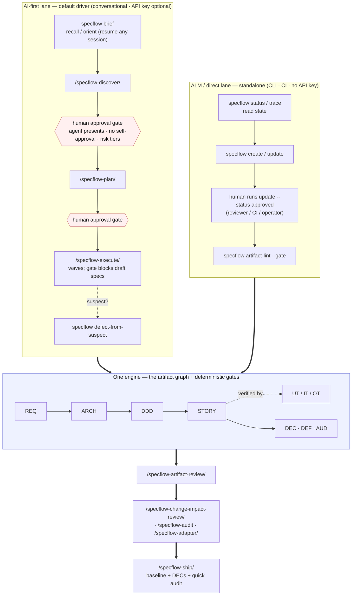

# SpecFlow Lifecycle

SpecFlow is **one engine driven two ways**:

- **AI-first (the default experience).** You talk; an agent runs the `/specflow-*` skills, manages the artifact graph, and escalates to you at approval gates. Optional API key for richer judgement.
- **ALM / direct (the standalone foundation).** The artifact graph, deterministic CLI, phase-gates, traceability, V-model tests, baselines, and RBAC work **with no API key** — a human, a team, or CI can drive the whole lifecycle by hand. This is a complete ALM in its own right; the AI layer is an optional driver on top of it, not a dependency.

Both lanes operate on the **same substrate and the same gates**, so you can mix them: an agent drafts in the AI-first lane, a reviewer approves in the ALM lane via CLI or CI. The skills never do anything you couldn't do by hand — they just compose the same `specflow …` commands.

> **Approval, in each lane.** "No self-approval" restrains the *agent*: it may never move an artifact from `draft` to `approved` on its own. In the ALM lane the human *is* the operator and approves directly by running `specflow update <ID> --status approved` (or via a reviewer / CI gate). Approval is always a human act — the lanes only differ in who surfaces the decision.

## Lifecycle Flowchart

Two lanes, one engine. AI-first is the default; ALM/direct stands alone.



<details>
<summary>Plain-text (ASCII) version of the same flowchart</summary>

```
                 ┌────────────────────────────────────────────────┐
                 │   ONE ENGINE — the artifact graph + gates        │
                 │   REQ → ARCH → DDD → STORY                       │
                 │   STORY verified by UT / IT / QT                 │
                 │   + DEC · DEF · AUD                              │
                 │   deterministic CLI · phase-gates · trace · lint │
                 └──────────▲───────────────────────────▲──────────┘
                            │                            │
   AI-FIRST (default driver)│                            │ ALM / DIRECT (standalone)
   conversational · API opt │      same commands,        │ CLI · CI · no API key
   ─────────────────────────│      same gates            │ ────────────────────────
   specflow brief  (recall) ─┘                           └─ specflow status / trace
            │                                                       │  (read state)
            ▼                                                       ▼
   /specflow-discover                                       specflow create / update
            │                                                       │
   ╔════════▼════════╗  human approves                              ▼
   ║ APPROVAL GATE   ║  (agent presents,                   human runs update
   ║ REQ → approved  ║   no self-approval, tiers)          --status approved
   ╚════════┬════════╝                                     (reviewer / CI / operator)
            ▼                                                       │
   /specflow-plan                                                   ▼
            │                                              specflow artifact-lint --gate
   ╔════════▼════════╗                                             │
   ║ APPROVAL GATE   ║                                             │
   ║ STORY → approved║                                             │
   ╚════════┬════════╝                                             │
            ▼                                                       │
   /specflow-execute ──suspect?──▶ specflow defect-from-suspect    │
   (gate blocks draft specs) ◀─────── resolve / DEF                │
            │                                                       │
            └───────────────────────┬───────────────────────────────┘
                                    ▼
                         /specflow-artifact-review
                                    │
            ┌───────────────────────┼───────────────────────┐
            ▼                       ▼                       ▼
   /specflow-change-        /specflow-audit         /specflow-adapter
    impact-review            (periodic full-          (configure CI, roles,
    (per-commit/PR;           project health;          adapters at any time)
     blast radius)            AUD + CHL)
                                    │
                                    ▼
                            /specflow-ship
                            (baseline + DECs + quick audit)
```
</details>

## Tier 1 — Slash Commands (the AI-first product)

These are what a user learns and uses day-to-day in the AI-first lane. Each is documented in [commands.md](commands.md) with a full interface spec.

| # | Slash Command | When to Use |
|---|---------------|-------------|
| 1 | `/specflow-init` | Starting a new project; installing skills, packs, CI |
| 2 | `/specflow-discover` | Capturing a new requirement through conversation |
| 3 | `/specflow-plan` | Breaking approved REQs into architecture + stories |
| 4 | `/specflow-execute` | Implementing approved stories with test generation |
| 5 | `/specflow-artifact-review` | Quality review of one or more specific artifacts |
| 6 | `/specflow-change-impact-review` | Blast-radius review of recent commits/PRs |
| 7 | `/specflow-audit` | Periodic full-project health check |
| 8 | `/specflow-ship` | Cutting a release: baseline + change records + quick audit |
| 9 | `/specflow-adapter` | Configuring CI workflows, roles/RBAC, and adapters (any time) |
| 10 | `/specflow-pack-author` | Authoring a standards compliance pack |

## Tier 2 — The CLI = a standalone ALM (no agent required)

Every slash command above composes underlying `uv run specflow …` commands. Those commands **are the product** for the ALM / direct lane — power users, teams, and CI pipelines invoke them directly with no API key:

- **Recall & navigation:** `specflow brief` (one-call digest), `specflow status`, `specflow trace <ID>`
- **Authoring:** `specflow create`, `specflow update --status <status>`
- **Gates & validation:** `specflow artifact-lint [--type … | --gate <name>]`
- **Defects:** `specflow defect-from-suspect <ID> --req <REQ>` (suspect → DEF with traceability)
- **Release & change:** `specflow baseline`, `specflow document-changes`, `specflow project-audit`

See the [CLI Reference](cli-reference.md) for the full catalog organized by workflow phase.
